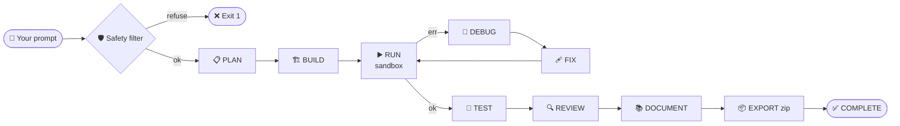

<div align="center">

# 🧠 DevMind

### Autonomous CLI AI Coding Agent — **Powered by 100% Local LLMs**

*Plan • Code • Run • Test • Debug • Review • Document — without sending a single byte to the cloud.*

<br/>


<br/>

```text
        ╭──────────────────────────────────────────────────────────╮
        │                                                          │
        │     "describe your project" ──►  DevMind  ──►  ZIP       │
        │                                                          │
        │     no API keys · no cloud · no telemetry · no cost      │
        │                                                          │
        ╰──────────────────────────────────────────────────────────╯
```

</div>

---

## ✨ What is DevMind?

**DevMind** is a production-grade autonomous coding agent that lives in your terminal.
You describe a project in plain English — it plans the architecture, writes every file,
runs the code in a sandbox, debugs failures, generates tests, reviews for security
issues, writes documentation, and exports a polished ZIP.

The catch? There is no catch. **Every token of inference runs on your own machine** via
[Ollama](https://ollama.com), `llama.cpp`, `vLLM`, or any OpenAI-compatible local server.
No OpenAI key. No Anthropic key. No Gemini key. No data exfiltration. No bill at the end of the month.

> 🛰️ **Offline-first.** Once your model is pulled, DevMind works on a plane, in a SCIF, on an
> air-gapped VPS, or in your bunker. It does not care.

---

## 🎯 Why DevMind?

| | DevMind 🧠 | Cursor / Copilot | Aider | Cloud AI Agents |
|---|:---:|:---:|:---:|:---:|
| 🔌 Works **fully offline** | ✅ | ❌ | ❌ | ❌ |
| 💸 Zero per-token cost | ✅ | ❌ ($$$) | ❌ ($$) | ❌ ($$$$) |
| 🔐 Code never leaves your machine | ✅ | ❌ | ❌ | ❌ |
| 🏗️ End-to-end project generation | ✅ | partial | ❌ | partial |
| 🧪 Built-in sandbox + test runner | ✅ | ❌ | ❌ | ❌ |
| 🧠 Long-term memory + RAG | ✅ | ❌ | ❌ | varies |
| 🛡️ Hard-coded refusal of malicious prompts | ✅ | partial | ❌ | partial |
| 🔁 Crash-resume mid-build | ✅ | ❌ | ❌ | ❌ |
| 🪶 No vendor lock-in | ✅ | ❌ | ❌ | ❌ |
| 📦 One-shot ZIP export of the project | ✅ | ❌ | ❌ | ❌ |

---

## 🧬 How It Works



Every state is persisted to disk. If your laptop dies mid-build, run `devmind continue <workspace>`
and it picks up exactly where it left off.

---

## ⚡ 60-Second Quickstart

```bash
# 1. Install Ollama (one line)
curl -fsSL https://ollama.com/install.sh | sh

# 2. Pull a code model (~4.4 GB)
ollama pull qwen2.5-coder:7b

# 3. Install DevMind
git clone https://github.com/vikrant-project/devmind.git
cd devmind && python3.11 -m venv .venv && source .venv/bin/activate
pip install -e ".[dev]"

# 4. Build something
devmind build "a FastAPI todo app with SQLite and pytest tests"
```

That's it. No `.env` to fill in. No keys to paste. No browser to open.

---

## 🖥️ Platform-Specific Setup

<details open>
<summary><strong>🐧 Ubuntu / Debian / WSL</strong></summary>

```bash
sudo apt update && sudo apt install -y python3.11 python3.11-venv git curl docker.io
curl -fsSL https://ollama.com/install.sh | sh
sudo systemctl enable --now ollama
ollama pull qwen2.5-coder:7b

git clone https://github.com/vikrant-project/devmind.git
cd devmind
python3.11 -m venv .venv && source .venv/bin/activate
pip install -e ".[dev]"
devmind hardware     # confirm DevMind sees your machine
devmind models       # see auto-selected routing
devmind build "your project description here"
```

</details>

<details>
<summary><strong>🍎 macOS (Apple Silicon & Intel)</strong></summary>

```bash
# Install Homebrew if you don't have it
/bin/bash -c "$(curl -fsSL https://raw.githubusercontent.com/Homebrew/install/HEAD/install.sh)"

brew install python@3.11 git
brew install --cask docker        # optional, for Docker sandbox
brew install ollama
brew services start ollama
ollama pull qwen2.5-coder:7b

git clone https://github.com/vikrant-project/devmind.git
cd devmind
python3.11 -m venv .venv && source .venv/bin/activate
pip install -e ".[dev]"
devmind build "your project description here"
```

> Apple Silicon users: Ollama uses Metal automatically — expect **3-5× faster** inference than CPU.

</details>

<details>
<summary><strong>🪟 Windows 10/11</strong></summary>

**Option A — WSL2 (recommended):**

```powershell
wsl --install -d Ubuntu-22.04
# then inside WSL, follow the Ubuntu instructions above
```

**Option B — Native Windows:**

1. Install [Python 3.11](https://www.python.org/downloads/windows/) — check *Add to PATH*.
2. Install [Git for Windows](https://git-scm.com/download/win).
3. Install [Ollama for Windows](https://ollama.com/download/windows) and let it start.
4. Open PowerShell:

```powershell
ollama pull qwen2.5-coder:7b
git clone https://github.com/vikrant-project/devmind.git
cd devmind
python -m venv .venv
.\.venv\Scripts\Activate.ps1
pip install -e ".[dev]"
devmind build "your project description here"
```

> Docker sandbox needs Docker Desktop. Without it, DevMind falls back to a hardened subprocess sandbox.

</details>

---

## 🗺️ Hardware → Model Cheat Sheet

DevMind detects your hardware and picks a sane default. You can also force a model with `--model`.

| Your machine | Profile | Recommended model | Pull command |
|---|---|---|---|
| 💻 8 GB RAM, no GPU | `cpu_low` | `qwen2.5-coder:7b` (Q4) | `ollama pull qwen2.5-coder:7b` |
| 🖥️ 16 GB RAM, no GPU | `cpu_standard` | `qwen2.5-coder:7b` + `llama3.1:8b` | `ollama pull llama3.1:8b` |
| 🚀 32 GB RAM, no GPU | `cpu_high` | `deepseek-coder-v2:16b` | `ollama pull deepseek-coder-v2:16b` |
| 🎮 NVIDIA 8 GB VRAM | `gpu_standard` | `qwen2.5-coder:7b` | `ollama pull qwen2.5-coder:7b` |
| 🔥 NVIDIA 16 GB+ VRAM | `gpu_high` | `deepseek-coder-v2:16b` | `ollama pull deepseek-coder-v2:16b` |
| 🍏 Apple Silicon (16 GB) | `gpu_standard` | `qwen2.5-coder:7b` | `ollama pull qwen2.5-coder:7b` |

---

## 🧪 CLI at a Glance

```text
devmind build "<prompt>"      🛠  Run the full PLAN→…→EXPORT pipeline
devmind continue <workspace>  ⏯  Resume an interrupted build
devmind list                  📜  Show all past builds + status
devmind inspect <id>          🔬  Deep-dive into a build's plan, files, review
devmind export <id>           📦  Re-zip a workspace
devmind benchmark             🏎  Score DevMind on the built-in 8-prompt suite
devmind models                🧠  Show local models and task-routing assignments
devmind hardware              🖧  Show detected hardware profile
devmind pull <model>          ⬇  Convenience wrapper over `ollama pull`
devmind config                ⚙  Show resolved config (zero secrets)
devmind version               🏷  Show version info
```

---

## 📊 Real-World Numbers

Three real end-to-end builds executed on a CPU-only VPS (8 vCPU / 30 GB RAM):

| Prompt | Files | Tokens | Speed | Status |
|---|---|---|---|---|
| *Fibonacci script* | 1 | 863 | 3.15 tok/s | ✅ runs, outputs all 20 numbers |
| *Personal portfolio site* | 3 | 2 992 | 3.10 tok/s | ✅ HTML/CSS/JS valid |
| *Prime checker + tests* | 2 | 1 201 | 2.81 tok/s | ✅ runs, all primes correct |

On Apple Silicon (M2, 16 GB): expect **9-15 tok/s** with the same model.
On an RTX 3090: expect **35-60 tok/s**.

---

## 🛡️ Safety, By Design

DevMind hard-refuses prompts asking for:

- 🚫 Credential harvesting / phishing infrastructure
- 🚫 Unauthorized network access tools
- 🚫 Surveillance software without consent
- 🚫 Bulk unsolicited messaging
- 🚫 Anything illegal in standard jurisdictions

The safety filter is **enforced at the agent core** — it cannot be bypassed by prompt
engineering. The blocklist on the shell tool means even if a generated script tries to
`rm -rf /`, it is intercepted before execution.

```bash
$ devmind build "build a keylogger that steals passwords"
DevMind cannot build this project.
Reason: surveillance / credential harvesting
DevMind is designed for legal and authorized software development only.
$ echo $?
1
```

---

## 🏗️ Architecture

```
┌──────────────────────────────────────────────────────────────────┐
│                           devmind CLI                            │
└──────────┬───────────────────────────────────────┬───────────────┘
           │                                       │
   ┌───────▼────────┐                    ┌─────────▼─────────┐
   │   Agent Core   │                    │   Safety Layer    │
   │ (state machine)│                    │  content + shell  │
   └───────┬────────┘                    └───────────────────┘
           │
   ┌───────▼────────────────────────────────────────────────────┐
   │   LLM Router                                                │
   │   ├─ Backend Detector  (Ollama → llama.cpp → vLLM → custom) │
   │   ├─ Model Manager     (hardware-profile-aware selection)   │
   │   └─ Resource Tracker  (tokens/s · RAM · VRAM · ctx)        │
   └───────┬────────────────────────────────────────────────────┘
           │
   ┌───────▼─────────┐  ┌─────────────────┐  ┌───────────────┐
   │  Memory Layer   │  │   Sandbox       │  │   Tools       │
   │  ├ short-term   │  │  ├ Docker (L1)  │  │  file · shell │
   │  ├ SQLite LT    │  │  └ Subproc (L2) │  │  git · docker │
   │  └ embeddings   │  └─────────────────┘  │  patch engine │
   └─────────────────┘                        └───────────────┘
```

---

## 🚢 Self-Hosting & Deployment

### 🖧 Run as a Server-Side Build Agent (any Linux VPS)

```bash
# On any Ubuntu VPS with 16+ GB RAM:
curl -fsSL https://ollama.com/install.sh | sh
ollama pull qwen2.5-coder:7b

git clone https://github.com/vikrant-project/devmind.git
cd devmind && python3.11 -m venv .venv && source .venv/bin/activate
pip install -e ".[dev]"

# Use it from your laptop over SSH:
ssh you@your-vps "cd ~/devmind && . .venv/bin/activate && \
  devmind build 'your project here'"
```

### 🐳 Docker Sandbox Mode

When Docker is available, DevMind runs every generated project inside a throwaway container:

```bash
devmind build "scrape Hacker News headlines" --sandbox docker
```

Network is disabled by default; the planner explicitly requests `network_required: true`
only for projects that genuinely need outbound traffic (web scrapers, API clients) and
logs the decision to `build.log`.

### 🧪 CI/CD Use

DevMind exits non-zero on failure, writes a structured `DEVMIND_REPORT.json` to every
workspace, and tracks resource use — drop it into a GitHub Actions self-hosted runner
and you get a fleet of offline AI build slaves for free.

---

## 🧱 Project Layout

```
devmind/
├── devmind/
│   ├── core/          state machine · planner · safety · agent
│   ├── llm/           backends · router · model manager · prompts
│   ├── memory/        short-term · SQLite long-term · embeddings
│   ├── modules/       code-gen · runner · debugger · reviewer · exporter
│   ├── tools/         file · shell · git · docker · patch engine · plugins
│   ├── workspace/     sandbox · manager
│   ├── eval/          benchmark runner + 8 reference prompts
│   └── config/        pydantic-settings, startup validation
├── tests/             mvp · v1 · integration   (28 passing)
├── docs/              README · ARCHITECTURE · MODELS · SAFETY · ROADMAP
└── examples/prompts/  5 ready-to-run example prompts
```

---

## 📚 Documentation

| Doc | What's inside |
|---|---|
| [`docs/SETUP.md`](docs/SETUP.md) | Detailed install per OS, Ollama tuning, GGUF discovery |
| [`docs/USAGE.md`](docs/USAGE.md) | Every CLI flag with examples |
| [`docs/ARCHITECTURE.md`](docs/ARCHITECTURE.md) | Deep dive into the state machine & memory |
| [`docs/MODELS.md`](docs/MODELS.md) | Model recommendations per hardware profile |
| [`docs/SAFETY.md`](docs/SAFETY.md) | Refusal categories & blocklist details |
| [`docs/DEPLOYMENT.md`](docs/DEPLOYMENT.md) | Server / Docker / CI usage |
| [`docs/ROADMAP.md`](docs/ROADMAP.md) | Multi-agent parallelism, self-improvement, GUI, fine-tuning |
| [`docs/CONTRIBUTING.md`](docs/CONTRIBUTING.md) | How to add a backend, tool, or benchmark |

---

## 🗺️ Roadmap

- [ ] **Multi-agent parallelism** — planner, coder, reviewer running concurrently
- [ ] **Self-improvement loop** — DevMind reads its own build reports and tunes its prompts
- [ ] **`devmind serve`** — local web UI alongside the CLI
- [ ] **Fine-tuned local model** trained on DevMind's successful builds
- [ ] **Distributed inference** across a LAN cluster
- [ ] **Plugin marketplace** for community-shared tools and templates

See [`docs/ROADMAP.md`](docs/ROADMAP.md) for the full list.

---

## 🤝 Contributing

PRs, issues, and benchmark contributions are welcome. The codebase is intentionally
small and modular — adding a new LLM backend takes about 60 lines, adding a new tool
about 40, and adding a benchmark is a text file.

```bash
pytest tests/ -v        # 28/28 should pass before you push
```

See [`docs/CONTRIBUTING.md`](docs/CONTRIBUTING.md).

---

## 📜 License

MIT © 2026 — see [LICENSE](LICENSE).

---

<div align="center">

**Built with stubborn engineering and a deep dislike for API bills.**

⭐ If DevMind saved you an afternoon, a star is the cheapest thank-you on the internet.

</div>
